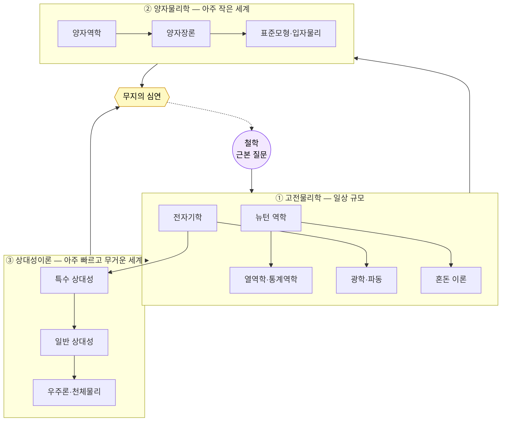

# 00 · 개요: 물리학이라는 한 장의 지도

[← README](../README.md) · [목차](../README.md#목차) · [다음: 물리학 발전사 →](06-history-of-physics.md)

---

## 이 저장소를 보는 두 가지 눈

같은 물리학을 두 방향에서 봅니다. 둘은 경쟁이 아니라 한 그림의 가로축·세로축입니다.

- **🗺️ 주제 지도 (공간축)** — 분야들이 어떻게 **연결**되나 → 이 문서의 *전체 지도* 와 [01~04](01-classical-physics.md)
- **⏳ 발전 지도 (시간축)** — 그 분야들이 언제 어떻게 **생겨났나** → [06 물리학 발전사](06-history-of-physics.md)

아래 *5분 요약* 은 주제 지도의 큰 줄기를, [06 발전사](06-history-of-physics.md) 는 그 줄기들이
자라온 순서를 보여줍니다.

---

## 5분 요약 (TL;DR)

물리학은 **"세상은 무엇으로 이루어졌고, 어떻게 움직이는가?"** 라는 철학적 질문에서 출발했습니다.
이 질문에 답하려는 시도가 세 갈래의 큰 줄기로 자랐습니다.

1. **고전물리학** — 우리가 일상에서 보고 만지는 규모의 세계. 공·행성·열·전기·빛.
   뉴턴에서 시작해 19세기 말까지 완성된 "상식적인" 물리학.
2. **양자물리학** — 원자보다 작은 세계. 확률·불확정성·입자와 파동의 이중성이 지배.
   물질과 빛이 무엇으로 되어 있는지를 다룬다.
3. **상대성이론** — 아주 빠르거나 아주 무거운 세계. 시간과 공간이 휘고 늘어난다.
   중력과 우주 전체의 모양을 다룬다.

양자물리학과 상대성이론은 각자 자기 영역에서 놀랍도록 정확하지만, **둘을 하나로 합치는 데는 아직 실패**했습니다.
이 합쳐지지 않는 빈틈, 그리고 암흑물질·암흑에너지 같은 모르는 것들이 모인 곳이 **무지의 심연**입니다.
결국 지도는 출발점이었던 **철학**으로 되돌아옵니다. 물리학의 최전선은 다시 "우리는 무엇을 모르는가"라는 질문이기 때문입니다.

---

## 전체 지도

---

## 여정: 지도는 어떻게 이어지는가

### 출발 — 철학
고대 사람들은 "만물의 근원은 무엇인가"를 물었습니다. 이 질문에 **관찰·실험·수학**으로 답하기
시작하면서 물리학이 철학에서 갈라져 나왔습니다.

### 1막 — 고전물리학의 시대
**아이작 뉴턴**이 운동 법칙과 만유인력, 그리고 그것을 다룰 도구인 **미적분**을 내놓으며 물리학이
하나의 체계가 됩니다. 이후 열(열역학), 전기와 자기(전자기학), 빛(광학)이 차례로 정리되어
19세기 말에는 "이제 물리학은 거의 다 끝났다"는 분위기마저 있었습니다.

### 2막 — 두 갈래의 혁명
그런데 두 개의 작은 균열이 20세기 물리학을 통째로 바꿉니다.
- **아주 작은 것**을 보니 고전물리학이 맞지 않았다 → **양자물리학**
- **아주 빠르고 무거운 것**을 보니 시간·공간이 절대적이지 않았다 → **상대성이론**

### 종착 — 무지의 심연, 그리고 다시 철학
두 혁명은 각각 완벽에 가깝지만 서로 충돌합니다. 블랙홀 내부나 우주의 시작처럼
**두 이론이 동시에 필요한 곳**에서는 답이 없습니다. 여기에 암흑물질·암흑에너지처럼
관측은 되지만 정체를 모르는 것들이 더해져 **무지의 심연**을 이룹니다.
이 심연 앞에서 물리학은 다시 "실재란 무엇인가"라는 철학적 질문과 만납니다.

---

## 한눈에 보는 비교표

| 영역 | 다루는 규모 | 대표 인물 | 핵심 아이디어 | 한계 |
|---|---|---|---|---|
| 고전물리학 | 일상 (m, kg, s) | 뉴턴, 맥스웰 | 결정론적 법칙, 힘과 운동 | 아주 작거나 빠른 세계에서 깨짐 |
| 양자물리학 | 원자 이하 | 플랑크, 슈뢰딩거 | 확률, 불확정성, 양자화 | 중력을 포함하지 못함 |
| 상대성이론 | 우주·고속 | 아인슈타인 | 휘어진 시공간 | 미시 세계에서 깨짐 |
| 무지의 심연 | 경계·극한 | — | 양자중력, 암흑우주 | 아직 이론 없음 |

> 이 표를 **시간 순서**로 다시 보고 싶다면 → [06 물리학 발전사](06-history-of-physics.md)

---

[← README](../README.md) · [목차](../README.md#목차) · [다음: 물리학 발전사 →](06-history-of-physics.md)
