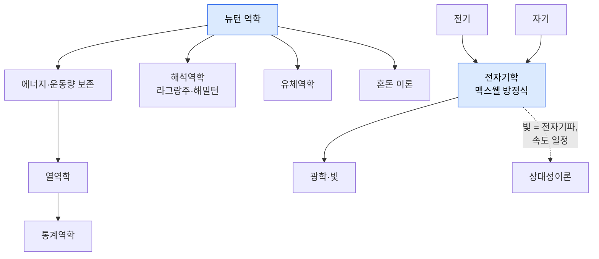

# 01 · 고전물리학 (Classical Physics)

[← 개요](00-overview.md) · [목차](../README.md#목차) · [다음: 양자물리학 →](02-quantum-physics.md)

> **한 줄 정의** · 우리가 일상에서 직접 보고 만지는 규모(공, 행성, 열, 전기, 빛)에서 세상이
> 어떻게 움직이는지를 다루는 물리학. 17세기 뉴턴에서 19세기 말까지 거의 완성되었다.

> **📜 발전사 속 위치** · *과학혁명 → 뉴턴 종합(1687) → 18~19세기 열·전자기의 정리* 시기에 해당.
> 시간 순서로 보려면 → [06 물리학 발전사](06-history-of-physics.md)

고전물리학의 세계는 **결정론적**입니다. 지금 상태를 정확히 알면, 법칙을 적용해 미래를
원리적으로 완벽하게 예측할 수 있다고 믿었습니다.

---

## 뉴턴 역학 (Newtonian / Classical Mechanics)

- **직관** · 물체에 힘을 주면 움직이는 방식이 바뀐다. 던진 공, 도는 행성, 부딪히는 당구공이
  모두 같은 규칙을 따른다는 것을 처음으로 보였다.
- **핵심 식** · 운동 제2법칙
  $$\vec{F} = m\vec{a}$$
  "힘은 질량 × 가속도" — 받은 힘에 비례해 속도가 변한다는 뜻.
- **만유인력** · 질량이 있는 모든 두 물체는 서로 끌어당긴다.
  $$F = G\frac{m_1 m_2}{r^2}$$
  거리가 멀어지면 끌림이 거리의 제곱에 반비례해 약해진다. 이 하나로 사과의 낙하와
  행성의 공전을 동시에 설명했다.
- **도구** · 뉴턴은 이 법칙을 다루기 위해 **미적분(calculus)** 을 함께 발명했다.
- **연결** · 여기서 에너지·운동량 보존, 해석역학, 유체역학, 혼돈 이론이 가지를 친다.

## 에너지·운동량 보존 (Conservation Laws)

- **직관** · 에너지와 운동량은 새로 생기거나 사라지지 않고 모양만 바꾼다.
  롤러코스터의 높이(위치에너지)가 속도(운동에너지)로 바뀌는 것이 예.
- **연결** · 보존 법칙은 모든 물리학을 관통하는 가장 강력한 원리로, 양자·상대성에서도 유지된다.

## 해석역학 (Analytical Mechanics — 라그랑주·해밀턴)

- **직관** · `F=ma`를 푸는 대신, "자연은 작용(action)을 최소로 만드는 경로를 택한다"는
  관점으로 같은 물리를 더 우아하게 기술하는 방식.
- **연결** · 이 **라그랑지안/해밀토니안** 형식은 훗날 양자역학과 양자장론의 언어가 된다.

## 혼돈 이론 (Chaos Theory)

- **직관** · 법칙이 결정론적이어도, 초기 조건의 미세한 차이가 시간이 지나면 완전히 다른
  결과로 증폭된다(나비효과). 날씨 예보가 어려운 이유.
- **연결** · "법칙을 알아도 예측이 어렵다"는 점에서 결정론의 한계를 보여준다.

## 열역학과 통계역학 (Thermodynamics & Statistical Mechanics)

- **직관** · 입자 하나하나가 아니라 **엄청나게 많은 입자의 집단**을 다룬다. 열·온도·압력이 주제.
- **핵심 개념** · **엔트로피(entropy)** — 무질서의 정도. 닫힌 계의 엔트로피는 줄지 않는다(열역학 제2법칙).
  이것이 "시간이 한 방향으로 흐른다"는 느낌(시간의 화살)의 물리적 뿌리.
- **연결** · 통계역학은 미시 입자의 운동으로 거시 열현상을 설명하며, 고전과 양자를 잇는 다리.

## 전자기학 (Electromagnetism)

- **직관** · 전기와 자기는 따로인 줄 알았으나, 사실 **하나의 현상의 양면**이다.
  전류가 자기를 만들고, 변하는 자기가 전류를 만든다.
- **핵심 식** · **맥스웰 방정식(Maxwell's equations)** — 전기와 자기를 하나로 묶은 네 개의 식.
  이 식을 풀면 **전자기파**가 빛의 속도로 퍼져 나간다는 결론이 나온다.
- **연결** · "빛은 전자기파이고 그 속도는 항상 일정하다"는 결론이 **상대성이론**의 직접적 출발점이 된다.

## 광학·빛 (Optics & Waves)

- **직관** · 반사·굴절·렌즈처럼 빛이 어떻게 움직이는지 다룬다. 빛은 파동처럼 행동한다.
- **연결** · 빛이 곧 전자기파임이 밝혀지며 광학은 전자기학에 통합되고,
  훗날 빛의 입자성(광자)은 **양자물리학**의 문을 연다.

---

## 요약표

| 분야 | 핵심 질문 | 대표 식·개념 |
|---|---|---|
| 뉴턴 역학 | 힘을 받으면 어떻게 움직이나? | $\vec{F}=m\vec{a}$ |
| 만유인력 | 왜 떨어지고 왜 도나? | $F=Gm_1m_2/r^2$ |
| 열역학 | 열은 어떻게 흐르나? | 엔트로피, 제2법칙 |
| 전자기학 | 전기·자기·빛의 관계는? | 맥스웰 방정식 |
| 혼돈 이론 | 왜 예측이 어렵나? | 나비효과 |

## 더 알아보기
- 미적분이 왜 운동 기술에 필수인지 → 변화율(미분)과 누적(적분)
- 엔트로피와 시간의 화살 → [무지의 심연](04-chasm-of-ignorance.md)
- 빛의 속도 불변 → [상대성이론](03-relativity.md)

---

[← 개요](00-overview.md) · [목차](../README.md#목차) · [다음: 양자물리학 →](02-quantum-physics.md)
