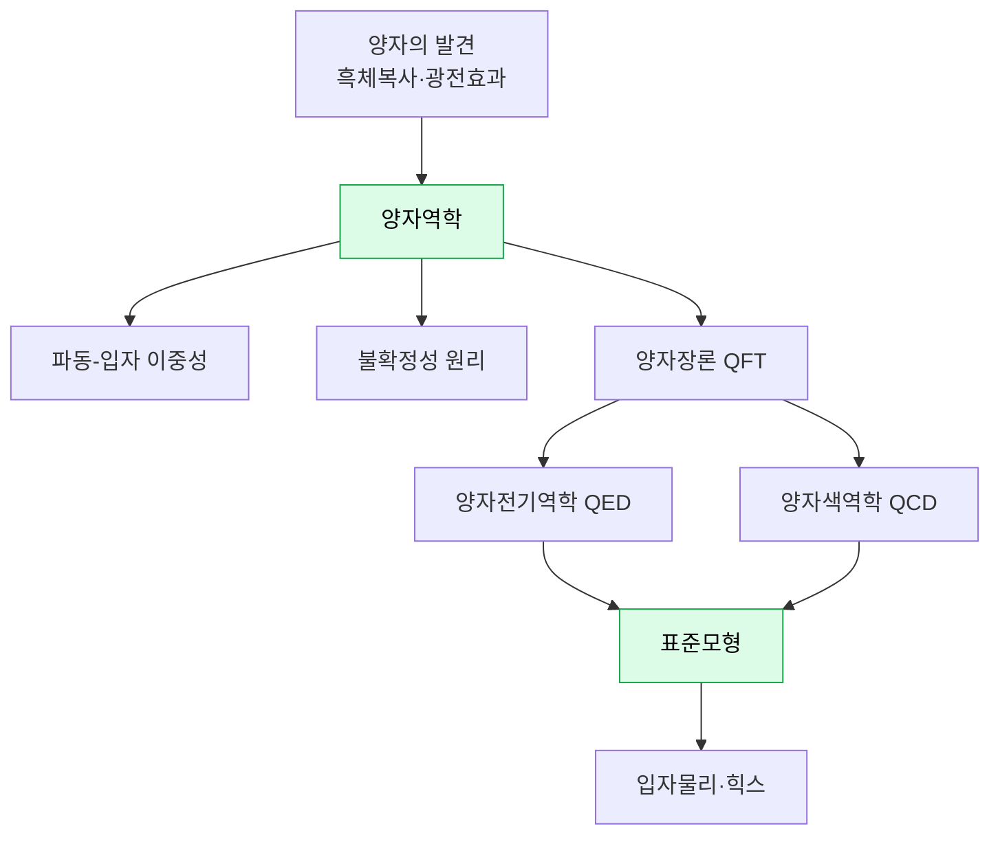

# 02 · 양자물리학 (Quantum Physics)

[← 고전물리학](01-classical-physics.md) · [목차](../README.md#목차) · [다음: 상대성이론 →](03-relativity.md)

> **한 줄 정의** · 원자보다 작은 세계에서 물질과 빛이 무엇으로 이루어졌고 어떻게 행동하는지를
> 다루는 물리학. 일상의 직관이 통하지 않고 **확률·불확정성·양자화**가 지배한다.

> **📜 발전사 속 위치** · *20세기 혁명* — 플랑크(1900)·보어(1913)·하이젠베르크(1925)·슈뢰딩거(1926).
> 시간 순서로 보려면 → [06 물리학 발전사](06-history-of-physics.md)

20세기 초, 아주 작은 것을 들여다보니 고전물리학의 예측이 맞지 않았습니다.
에너지가 연속이 아니라 **덩어리(양자, quantum)** 로만 주고받아진다는 사실에서 모든 것이 시작됩니다.

---

## 양자의 발견 (The Birth of the Quantum)

- **직관** · 뜨거운 물체가 내는 빛(흑체복사)과 금속에서 빛이 전자를 튕겨내는 현상(광전효과)을
  고전물리학으로 설명할 수 없었다. 플랑크와 아인슈타인은 **에너지가 덩어리로만 오간다**고 보면
  딱 맞아떨어진다는 것을 발견했다.
- **핵심 식** · 광자 하나의 에너지
  $$E = h\nu$$
  에너지는 진동수($\nu$)에 비례하며, 그 비례상수 $h$(플랑크 상수)가 양자 세계의 "최소 단위"를 정한다.

## 양자역학 (Quantum Mechanics)

- **직관** · 입자의 위치·속도를 콕 집어 말할 수 없고, **어디에 있을 확률**만 말할 수 있다.
  입자는 "여러 상태에 동시에 걸쳐 있다(중첩)"가, 측정하는 순간 하나로 정해진다.
- **핵심 식** · **슈뢰딩거 방정식** — 파동함수 $\psi$가 시간에 따라 어떻게 변하는지 알려준다.
  $$i\hbar\frac{\partial}{\partial t}\psi = \hat{H}\psi$$
  $|\psi|^2$ 가 "그 위치에서 발견될 확률"을 준다.
- **연결** · 고전 해석역학의 **해밀토니안 $\hat{H}$** 이 여기서 다시 등장한다.

## 파동-입자 이중성 (Wave–Particle Duality)

- **직관** · 빛도, 전자도 어떨 때는 파동처럼(간섭무늬), 어떨 때는 입자처럼(한 점에 도달) 행동한다.
  둘 중 하나가 아니라 **둘 다인 무언가**다. 이중슬릿 실험이 대표적 증거.

## 불확정성 원리 (Uncertainty Principle)

- **직관** · 위치를 정밀하게 알수록 운동량(속도)은 흐려진다. 둘을 동시에 완벽히 알 수 없다 —
  측정 기술의 한계가 아니라 자연의 근본 성질이다.
- **핵심 식** ·
  $$\Delta x \,\Delta p \geq \frac{\hbar}{2}$$

## 양자장론 (Quantum Field Theory, QFT)

- **직관** · 양자역학과 특수 상대성을 합친 더 깊은 이론. 입자는 사실 **장(field)의 들뜸(진동)** 이다.
  공간 전체에 퍼진 "전자 장"이 출렁이면 그 한 알갱이가 전자로 보인다.
- **연결** · 양자물리학과 상대성이론이 **부분적으로** 만나는 지점. (단, 중력은 아직 못 합쳤다 →
  [무지의 심연](04-chasm-of-ignorance.md))

### 양자전기역학 (QED) · 양자색역학 (QCD)
- **QED** · 전자기력을 양자장론으로 기술. 물리학에서 가장 정밀하게 검증된 이론.
- **QCD** · 강한 핵력(쿼크를 묶는 힘)을 기술. "색전하(color)"라는 성질을 다룬다.

## 표준모형과 입자물리학 (Standard Model & Particle Physics)

- **직관** · 지금까지 발견한 **기본 입자들과 세 가지 힘**(전자기력·약한 핵력·강한 핵력)을 담은
  현대 물리학의 "주기율표". 쿼크·렙톤(전자 등)·힘 전달 입자·**힉스 보손**으로 구성된다.
- **힉스 보손** · 다른 입자들이 질량을 갖게 하는 메커니즘. 2012년 LHC에서 발견.
- **빠진 것** · 네 번째 힘인 **중력**은 표준모형에 들어 있지 않다. 이것이 다음 영역과의 핵심 균열.
- **반물질(antimatter)** · 모든 입자에는 전하가 반대인 짝이 있다. 만나면 소멸하며 에너지를 낸다.

---

## 요약표

| 개념 | 일상 직관과 다른 점 | 핵심 식 |
|---|---|---|
| 양자화 | 에너지는 연속이 아니라 덩어리 | $E=h\nu$ |
| 양자역학 | 위치는 확률로만 존재 | $i\hbar\,\partial_t\psi=\hat H\psi$ |
| 불확정성 | 위치·운동량 동시 측정 불가 | $\Delta x\,\Delta p\ge\hbar/2$ |
| 표준모형 | 입자=장의 들뜸, 3가지 힘 | — (중력 제외) |

## 더 알아보기
- 왜 슈뢰딩거의 고양이가 "동시에 살고 죽었나" → 중첩과 측정 문제 → [무지의 심연](04-chasm-of-ignorance.md)
- QFT가 합친 상대성의 반쪽 → [상대성이론](03-relativity.md)
- 양자역학과 중력이 왜 안 합쳐지나 → [무지의 심연](04-chasm-of-ignorance.md)

---

[← 고전물리학](01-classical-physics.md) · [목차](../README.md#목차) · [다음: 상대성이론 →](03-relativity.md)
