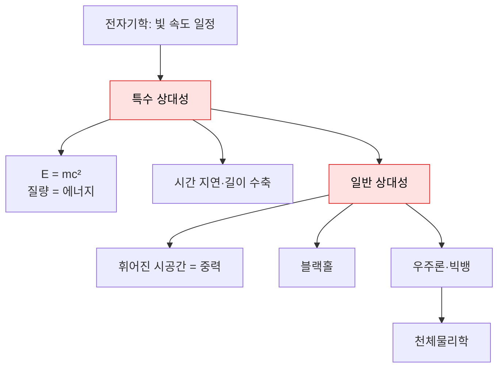

# 03 · 상대성이론 (Relativity)

[← 양자물리학](02-quantum-physics.md) · [목차](../README.md#목차) · [다음: 무지의 심연 →](04-chasm-of-ignorance.md)

> **한 줄 정의** · 아주 빠르게 움직이거나 아주 무거운 것의 세계에서, **시간과 공간이 절대적이지
> 않고 휘고 늘어난다**는 것을 밝힌 아인슈타인의 이론. 중력과 우주 전체의 모양을 다룬다.

> **📜 발전사 속 위치** · *20세기 혁명* — 아인슈타인의 특수 상대성(1905)·일반 상대성(1915).
> 시간 순서로 보려면 → [06 물리학 발전사](06-history-of-physics.md)

전자기학의 결론 — "빛의 속도는 누가 보든 항상 같다" — 를 진지하게 받아들이면,
시간과 공간에 대한 상식이 무너집니다. 여기서 상대성이론이 시작됩니다.

---

## 특수 상대성이론 (Special Relativity, 1905)

- **직관** · 빛의 속도가 모두에게 같으려면, 빠르게 움직이는 관찰자에게는 **시간이 느리게 가고
  길이가 짧아져야** 한다. 시간과 공간은 따로가 아니라 하나로 엮인 **시공간(spacetime)**.
- **시간 지연 / 길이 수축** · 빠를수록 시계가 천천히 가고(시간 지연), 진행 방향 길이가 줄어든다(길이 수축).
- **핵심 식** · 질량과 에너지는 같은 것의 두 모습이다.
  $$E = mc^2$$
  아주 작은 질량($m$)도 빛 속도의 제곱($c^2$)이라는 거대한 계수 때문에 엄청난 에너지가 된다.
  핵발전·핵무기·별이 빛나는 원리가 모두 이 식에서 나온다.
- **연결** · 특수 상대성 + 양자역학 = **양자장론** ([양자물리학](02-quantum-physics.md)).

## 일반 상대성이론 (General Relativity, 1915)

- **직관** · 중력은 "끌어당기는 힘"이 아니라, **질량이 시공간을 휘게 만들고** 다른 물체는 그
  휜 길을 따라 굴러갈 뿐이다. 트램펄린 위에 볼링공을 올리면 천이 움푹 패고, 구슬이 그쪽으로
  굴러가는 그림이 흔한 비유.
- **핵심 식** · 아인슈타인 장 방정식
  $$G_{\mu\nu} = \frac{8\pi G}{c^4} T_{\mu\nu}$$
  왼쪽(시공간이 얼마나 휘었나) = 오른쪽(거기에 물질·에너지가 얼마나 있나). "물질은 공간에게
  어떻게 휘라고 말하고, 공간은 물질에게 어떻게 움직이라고 말한다."
- **검증** · 별빛이 태양 옆에서 휘는 것, GPS 시간 보정, 중력파(2015년 직접 관측) 등으로 확인됨.

## 블랙홀 (Black Holes)

- **직관** · 시공간이 극단적으로 휘어 빛조차 빠져나오지 못하는 영역. 경계가 **사건의 지평선**.
- **연결** · 블랙홀 중심처럼 "엄청나게 무겁고(상대성) 동시에 엄청나게 작은(양자)" 곳에서
  두 이론이 충돌한다 → [무지의 심연](04-chasm-of-ignorance.md).

## 우주론과 천체물리학 (Cosmology & Astrophysics)

- **직관** · 일반 상대성을 우주 전체에 적용하면 우주가 정적이지 않고 **팽창**한다는 결론이 나온다.
  과거로 되감으면 한 점에서 시작했다는 **빅뱅** 모형으로 이어진다.
- **천체물리학** · 별의 탄생과 죽음, 은하, 우주의 구조를 다룬다. 별이 빛나는 것은 $E=mc^2$ 에 따른
  핵융합 덕분 — 상대성·양자·핵물리가 모두 만나는 무대.

---

## 요약표

| 개념 | 핵심 통찰 | 대표 식 |
|---|---|---|
| 특수 상대성 | 시간·공간은 관찰자에 따라 다르다 | $E=mc^2$ |
| 일반 상대성 | 중력 = 휘어진 시공간 | $G_{\mu\nu}=\tfrac{8\pi G}{c^4}T_{\mu\nu}$ |
| 블랙홀 | 빛도 못 빠져나오는 시공간 | 사건의 지평선 |
| 우주론 | 우주는 팽창한다 | 빅뱅 |

## 더 알아보기
- 빛 속도 불변의 출발점 → [전자기학](01-classical-physics.md#전자기학-electromagnetism)
- 상대성 + 양자 = 양자장론 → [양자물리학](02-quantum-physics.md#양자장론-quantum-field-theory-qft)
- 왜 중력은 양자화하기 어려운가 → [무지의 심연](04-chasm-of-ignorance.md)

---

[← 양자물리학](02-quantum-physics.md) · [목차](../README.md#목차) · [다음: 무지의 심연 →](04-chasm-of-ignorance.md)
