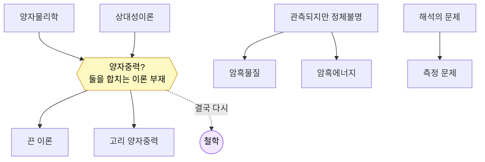

# 04 · 무지의 심연 (The Chasm of Ignorance)

[← 상대성이론](03-relativity.md) · [목차](../README.md#목차) · [다음: 용어집 →](05-glossary.md)

> **한 줄 정의** · 물리학이 아직 답하지 못한, 지도의 가장자리에 있는 거대한 빈틈.
> 특히 **양자물리학과 상대성이론이 하나로 합쳐지지 않는다**는 것이 핵심이다.

> **📜 발전사 속 위치** · *현대~미래* — 두 혁명 이후 남은 숙제(양자중력·암흑우주)가 모이는 발전사의 최전선.
> 시간 순서로 보려면 → [06 물리학 발전사](06-history-of-physics.md)

영상은 여기서 물리학의 정직한 한계를 보여줍니다. 두 이론은 각자 영역에서 놀랍도록 정확하지만,
**둘이 동시에 필요한 곳**에서는 무너집니다. 그 너머는 아직 지도에 그려지지 않은 미지의 땅입니다.

---

## 핵심 균열: 양자중력 (Quantum Gravity)

- **문제** · 양자물리학은 중력을 다루지 못하고, 일반 상대성은 양자 효과를 다루지 못한다.
  보통은 문제가 없다 — 중력이 중요한 것은 무거운 것, 양자가 중요한 것은 작은 것이니
  보통 둘이 겹치지 않기 때문이다.
- **충돌 지점** · 그러나 **블랙홀 중심**과 **빅뱅 직후의 우주**는 *무겁고 동시에 작다*.
  여기서는 두 이론이 모두 필요하지만, 함께 쓰면 무한대 같은 말이 안 되는 답이 나온다.
- **목표** · 둘을 통합하는 **양자중력 이론**, 더 나아가 모든 힘을 하나로 묶는
  **만물의 이론(Theory of Everything)** 을 찾는 것이 현대 물리학의 성배.

### 후보 이론들 (아직 검증되지 않음)
- **끈 이론(String Theory)** · 기본 입자가 점이 아니라 진동하는 작은 "끈"이라는 가설.
- **고리 양자중력(Loop Quantum Gravity)** · 시공간 자체가 더 쪼갤 수 없는 알갱이로 되어 있다는 가설.

> 두 후보 모두 수학적으로 정교하지만, 아직 **실험으로 확인된 것은 없다.**

## 관측되지만 정체를 모르는 것들

- **암흑물질(Dark Matter)** · 은하가 흩어지지 않고 도는 것을 보면 보이는 물질보다 훨씬 많은
  질량이 있어야 한다. 빛을 내지 않아 직접 보이지 않는 그 무언가. 정체 미상.
- **암흑에너지(Dark Energy)** · 우주의 팽창이 점점 빨라지고 있다. 이를 밀어내는 정체불명의 에너지로,
  우주 전체 에너지의 대부분을 차지한다고 추정되지만 정체 미상.

## 양자역학의 해석 문제 (Measurement / Interpretation)

- **문제** · 측정하기 전 입자가 "여러 상태에 중첩"되어 있다가 측정 순간 하나로 정해진다.
  그런데 *측정이란 무엇인가? 왜 정해지는가?* 는 물리가 아닌 해석의 영역으로 넘어간다
  (코펜하겐 해석, 다세계 해석 등).
- **연결** · 슈뢰딩거의 고양이 사고실험이 이 문제를 드러낸다 → [양자물리학](02-quantum-physics.md).

## 그 밖의 열린 질문들
- **물질-반물질 비대칭** · 빅뱅에서 물질과 반물질이 같게 생겼다면 다 소멸했어야 하는데,
  왜 물질이 살아남아 우주를 이루는가?
- **시간의 화살** · 미시 법칙은 시간 방향을 가리지 않는데, 왜 거시 세계의 시간은 한 방향(엔트로피 증가)인가?
  → [열역학](01-classical-physics.md#열역학과-통계역학-thermodynamics--statistical-mechanics)

---

## 다시 철학으로

지도의 끝은 출발점과 만납니다. "실재란 무엇인가, 우리는 무엇을 알 수 있는가" —
물리학의 최전선은 결국 **철학적 질문**과 다시 마주칩니다. 모른다는 것을 정확히 아는 것,
그것이 다음 발견의 출발점입니다.

## 요약표

| 미해결 문제 | 무엇이 문제인가 | 상태 |
|---|---|---|
| 양자중력 | 양자 + 중력 통합 실패 | 후보 이론만 존재 |
| 암흑물질 | 보이지 않는 질량의 정체 | 관측됨, 정체 미상 |
| 암흑에너지 | 가속 팽창의 원인 | 관측됨, 정체 미상 |
| 측정 문제 | 중첩이 왜 붕괴하나 | 해석 논쟁 중 |

---

[← 상대성이론](03-relativity.md) · [목차](../README.md#목차) · [다음: 용어집 →](05-glossary.md)
