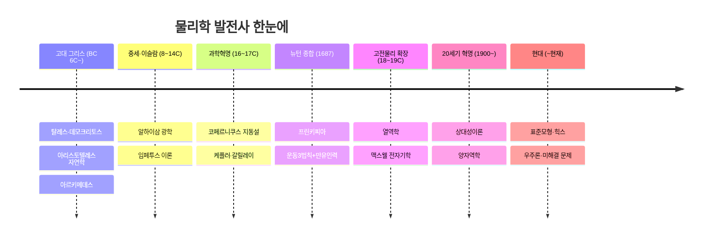

# 06 · 물리학 발전사 (The Map of Physics — 시간축)

[← 개요](00-overview.md) · [목차](../README.md#목차) · [다음: 고전물리학 →](01-classical-physics.md)

> **한 줄 정의** · 고대 그리스의 자연철학에서 오늘날의 양자·우주론까지, 물리학이 **어떤 순서로
> 발전해 왔는지**를 따라가는 시간축 지도. ([주제축 지도](00-overview.md)와 짝을 이룬다.)

물리학의 큰 발견은 대개 **앞선 발견이 남긴 균열**에서 태어났습니다. 아래 흐름을 따라가면
"왜 다음 단계가 필요했는지"가 보입니다.

---

## 1. 고대 그리스 — 자연철학의 시작

- **직관** · "세상은 무엇으로 되어 있나"를 **신화가 아니라 원리**로 설명하려는 첫 시도.
- **탈레스(Thales)** · 만물의 근원을 묻고 자연을 합리적으로 설명하려 한 최초의 인물로 꼽힌다.
- **데모크리토스(Democritus)** · 더 쪼갤 수 없는 알갱이 **원자(atomos)** 개념을 제시.
- **아리스토텔레스(Aristotle)** · 《자연학》으로 운동·물질을 체계화. 지구 중심, 4원소설,
  "물체는 자기 본성의 자리로 움직인다"는 운동관 — 이후 **약 2,000년간** 서양 물리학을 지배.
- **아르키메데스(Archimedes)** · 지렛대·부력을 정량적으로 다뤄, 수학과 물리를 잇는 길을 엶.

## 2. 중세와 이슬람 황금기 — 실험의 씨앗

- **이븐 알하이삼(Alhazen)** · 《광학》에서 가설을 **실험으로 검증**하는 방법을 강조 — 근대 과학적
  방법의 선구.
- **임페투스(impetus) 이론** · 후기 중세 학자들이 "던져진 물체가 계속 가는 이유"를 고민하며
  훗날의 **관성** 개념으로 가는 다리를 놓음.

## 3. 과학혁명 (16~17세기) — 방법이 바뀌다

자연 탐구가 **사변에서 관찰·수학·실험**으로 전환된 결정적 시기.

- **코페르니쿠스(Copernicus, 1543)** · 지구가 아니라 **태양이 중심**(지동설)이라고 제안.
- **케플러(Kepler)** · 행성이 **타원** 궤도를 돈다는 행성운동 3법칙.
- **갈릴레이(Galileo)** · 망원경 관측(목성의 위성 등), 낙하·관성 실험. *"자연은 수학의 언어로 쓰였다."*
  실험과 수학을 결합한 근대 과학의 방법을 세움.
- **데카르트(Descartes)** · 기계론적 자연관과 좌표 개념을 제공.

## 4. 뉴턴의 종합 (1687) — 고전물리학의 탄생

- **뉴턴(Newton)** · 《프린키피아》에서 **운동 3법칙 + 만유인력 + 미적분**을 한데 묶어,
  떨어지는 사과와 도는 행성을 **하나의 법칙**으로 설명. 천상과 지상의 물리가 통합됨.
- **연결** · 여기서부터 [① 고전물리학](01-classical-physics.md)의 세계가 본격적으로 펼쳐진다.

## 5. 고전물리학의 확장 (18~19세기)

뉴턴의 틀 위에서 새로운 분야들이 차례로 정리됨.

- **해석역학** · 라그랑주·해밀턴이 역학을 더 우아한 수학 형식으로 재구성(훗날 양자역학의 언어).
- **열역학·통계역학** · 카르노·줄·클라우지우스·켈빈이 열의 법칙을, 볼츠만이 **엔트로피**를 통계로 설명.
- **전자기학** · 외르스테드·앙페르·**패러데이(전자기 유도)** 를 거쳐 **맥스웰**이 전기·자기·빛을
  하나로 통합하고 **전자기파**를 예측. 빛이 전자기파임이 밝혀짐.
- 19세기 말, "물리학은 거의 완성됐고 소수점 자리만 남았다"는 낙관이 퍼짐 — 그러나…
- **연결** · 이 시기의 결실 전체가 [① 고전물리학](01-classical-physics.md)에 정리되어 있다.

## 6. 20세기 두 혁명 — 두 점의 먹구름

"거의 완성됐다"던 고전물리학에 두 개의 풀리지 않는 문제(흑체복사, 빛의 속도)가 남아 있었고,
이것이 물리학을 통째로 다시 썼다.

- **상대성이론** · 아인슈타인이 1905년 **특수 상대성**($E=mc^2$), 1915년 **일반 상대성**(중력=휘어진 시공간)을 발표.
  → [③ 상대성이론](03-relativity.md)
- **양자역학** · 플랑크(1900 양자가설) → 아인슈타인(광전효과) → 보어(1913 원자모형) →
  드브로이 → 하이젠베르크(불확정성, 1925) → 슈뢰딩거(파동방정식, 1926) → 디랙(반물질).
  → [② 양자물리학](02-quantum-physics.md)

## 7. 현대에서 미래로 (20세기 중반~현재)

- **종합** · 양자역학+특수상대성 = **양자장론** → QED·QCD → **표준모형**, **힉스 보손** 발견(2012).
- **우주론** · 허블의 **우주 팽창** 발견 → **빅뱅** 모형. 이후 **암흑물질·암흑에너지**라는 새 수수께끼 등장.
- **남은 숙제** · 양자역학과 일반상대성을 합치는 **양자중력**은 아직 미완성.
  → [④ 무지의 심연](04-chasm-of-ignorance.md), 그리고 다시 철학으로.

---

## 연대표 요약

| 시대 | 핵심 전환 | 대표 인물 | 주제축 연결 |
|---|---|---|---|
| 고대 그리스 | 신화→원리 | 아리스토텔레스 | — |
| 과학혁명 | 사변→실험·수학 | 갈릴레이·케플러 | [고전](01-classical-physics.md) |
| 뉴턴 종합 | 천상·지상 통합 | 뉴턴 | [고전](01-classical-physics.md) |
| 18~19세기 | 열·전자기 정리 | 맥스웰 | [고전](01-classical-physics.md) |
| 20세기 혁명 | 시공간·확률 | 아인슈타인·보어 | [상대성](03-relativity.md)·[양자](02-quantum-physics.md) |
| 현대 | 종합과 미해결 | — | [무지의 심연](04-chasm-of-ignorance.md) |

## 더 알아보기
- 각 시대가 낳은 분야의 자세한 내용 → 위 표의 *주제축 연결* 링크
- 전체 구조를 한눈에 → [00 개요의 전체 지도](00-overview.md#전체-지도)

---

[← 개요](00-overview.md) · [목차](../README.md#목차) · [다음: 고전물리학 →](01-classical-physics.md)
