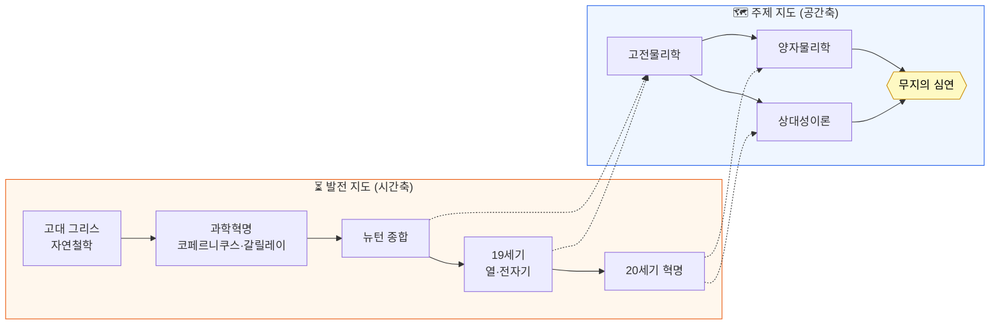

# 물리학의 지도 (The Map of Physics)

물리학 전체를 두 가지 관점의 "지도"로 정리한 저장소입니다.

- **주제 지도 (공간축)** — 물리학의 분야들이 어떻게 서로 **연결**되는가
- **발전 지도 (시간축)** — 물리학이 고대 그리스부터 오늘날까지 어떻게 **발전**해 왔는가

같은 풍경을 위에서 내려다본 지도(주제)와, 걸어온 길을 따라 그린 지도(역사)로 함께 보면
물리학이라는 큰 그림이 훨씬 또렷해집니다.

> **정리한 영상**
> - [물리학의 발전 지도 (THE MAP OF PHYSICS)_33](https://www.youtube.com/watch?v=h6_dj8VIoN0) — 고대 그리스→현대의 연대순 발전사 (시간축)
> - "The Map of Physics" — Dominic Walliman / [Domain of Science](https://www.youtube.com/channel/UCxqAWLTk1CmBvZFPzeZMd9A) 가 대중화한 분야별 지도 (공간축)

---

## 두 지도가 만나는 곳

시간축(발전사)을 따라가면 자연스럽게 공간축(주제 영역)의 큰 줄기들이 차례로 등장합니다.

---

## 목차

| 문서 | 관점 | 내용 | 난이도 |
|---|---|---|---|
| [00 · 개요](docs/00-overview.md) | 통합 | 두 지도 한눈에 보기 · 5분 요약 | ★☆☆ |
| [06 · 물리학 발전사](docs/06-history-of-physics.md) | 시간축 | 고대 그리스→현대 연대표 | ★★☆ |
| [01 · 고전물리학](docs/01-classical-physics.md) | 공간축 | 뉴턴 역학, 열역학, 전자기학, 빛 | ★★☆ |
| [02 · 양자물리학](docs/02-quantum-physics.md) | 공간축 | 양자역학, 양자장론, 표준모형 | ★★★ |
| [03 · 상대성이론](docs/03-relativity.md) | 공간축 | 특수·일반 상대성, 시공간, 우주론 | ★★★ |
| [04 · 무지의 심연](docs/04-chasm-of-ignorance.md) | 공간축 | 양자중력, 암흑물질, 미해결 문제 | ★★☆ |
| [05 · 용어집](docs/05-glossary.md) | 공통 | 핵심 용어·인물 한/영 사전 | ★☆☆ |

## 추천 학습 경로

- **이야기로 따라가기 (역사순)** → `00 개요` → `06 발전사` → 시대마다 연결된 주제 문서(01~04)
- **구조로 이해하기 (주제순)** → `00 개요` → `01 → 02 → 03 → 04`
- **빠른 복습** → 각 문서 맨 위 요약표 + `05 용어집`

> 각 주제 문서에는 **"📜 발전사 속 위치"** 박스가 있어, 그 분야가 [발전사 연대표](docs/06-history-of-physics.md)의
> 어느 시대에 해당하는지 바로 오갈 수 있습니다.

---

## 문서 작성 규칙 (기여·확장 시)

- 파일명: `NN-주제-slug.md` (두 자리 번호 + 영문 슬러그) — 정렬·링크 안정성
- 본문은 **한국어**, 핵심 용어·인물은 **한/영 병기** (예: 엔트로피(entropy), 갈릴레이(Galileo))
- 각 개념은 공통 템플릿을 따른다: **한 줄 정의 → 직관 → 핵심 식 → 연결 → 더 알아보기**
- 수식은 GitHub LaTeX(`$...$`, `$$...$$`)를 쓰되, **반드시 평이한 말로 의미를 덧붙인다**
- 문서 상단에는 **이전 / 목차 / 다음** 내비게이션을 둔다

## 출처와 면책

이 저장소는 위 영상들을 학습용으로 **요약·재구성**한 2차 자료입니다. 시간축(발전사)은
한국어 영상 *"물리학의 발전 지도"* 의 흐름을, 공간축(주제 분류)은 Dominic Walliman이 대중화한
*"The Map of Physics"* 의 틀을 따릅니다. 세부 설명은 이해를 돕기 위해 단순화되어 실제 물리학의
엄밀함과 차이가 있을 수 있으니, 더 깊은 내용은 각 문서의 *더 알아보기* 와 원본 영상을 참고하세요.
